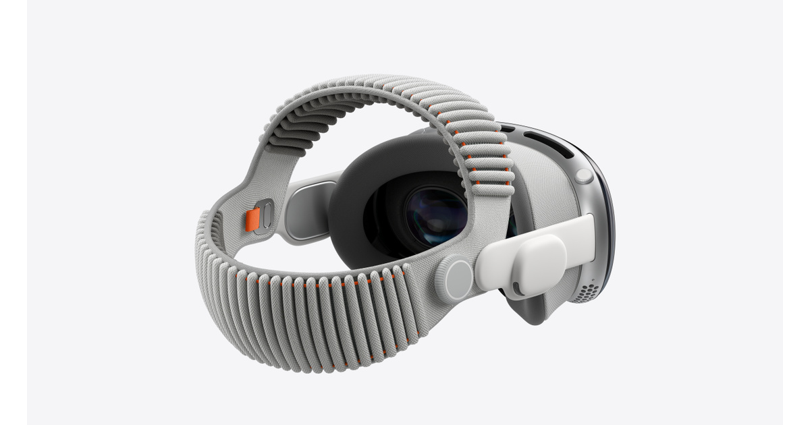

# Apple Vision Pro

## 基本信息

| 项目 | 内容 |
|---|---|
| 产品名 | Apple Vision Pro |
| 品牌 | Apple |
| 分类 | 头戴式 VR/空间计算设备 |
| 系列 | Apple Vision |
| 发布时间 | 2024 年 6 月，中国大陆上市 |
| 同期发布颜色 | 银色 |

## 产品介绍

Apple Vision Pro 是头戴式空间计算设备，可用于沉浸影音、空间照片视频、办公窗口和 3D 内容体验。

## 同期发布颜色

| 颜色 | 说明 |
|---|---|
| 银色 | 官方发布配色 |

## 核心卖点

- Apple 生态深度协同，适合与 iPhone、iPad、Mac、Apple Watch 等设备联动。
- 官方渠道价格透明，支持分期、送货、到店取货和 Apple Trade In 换购。
- 适合看重长期系统更新、硬件做工和售后服务的用户。

## 参数

| 项目 | 内容 |
|---|---|
| 芯片 | M2 + R1 |
| 显示 | 双 Micro-OLED 显示系统 |
| 交互 | 眼动、手势、语音 |
| 容量 | 256GB、512GB、1TB |

## 可选配置及中国价格

> 价格口径：中国大陆 Apple 官方在线商店起售价或常见基础配置价格，单位为人民币。实际成交价可能因渠道、促销、教育优惠、以旧换新、分期和库存变化。

| 配置 | 可选颜色 | 中国价格 |
|---|---|---:|
| 256GB | 银色 | RMB 29,999 |
| 512GB | 银色 | RMB 31,499 |
| 1TB | 银色 | RMB 32,999 |

## 电商式购买建议

重视空间影音和新交互体验可选。多数用户建议先线下体验再买。

## 适合人群

- 已在 Apple 生态内，想要更好设备协同的用户。
- 重视官方售后、系统更新和产品生命周期的用户。
- 想按预算和配置清晰选购的用户。

## 数据来源

- Apple 中国大陆官网产品页和在线商店页面。
- Apple 中国大陆官网技术规格页面。
- 中国大陆公开发售信息和 Apple 官方新闻稿。
