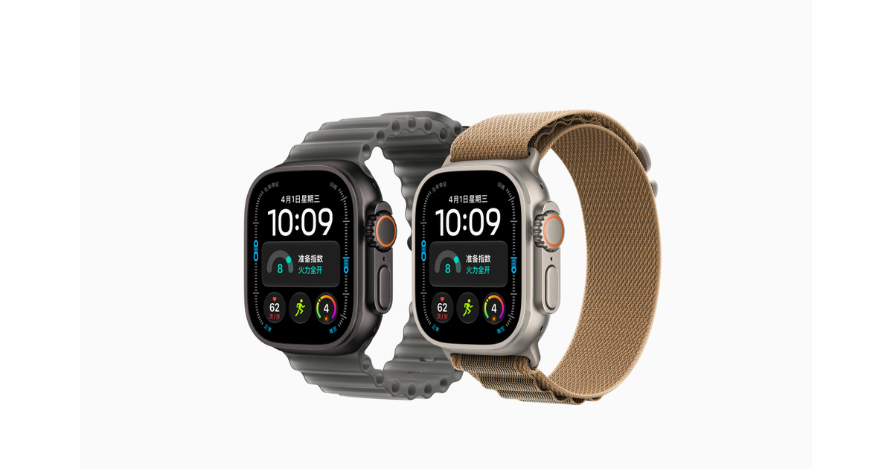

# Apple Watch Ultra 3

## 基本信息

| 项目 | 内容 |
|---|---|
| 产品名 | Apple Watch Ultra 3 |
| 品牌 | Apple |
| 分类 | 手表 |
| 系列 | Apple Watch Ultra |
| 发布时间 | 2025 年 9 月 |
| 同期发布颜色 | 原色钛金属、黑色钛金属 |

## 产品介绍

Apple Watch Ultra 3 面向户外、耐力运动和长续航用户，机身更坚固，定位和运动能力更强。

## 同期发布颜色

| 颜色 | 说明 |
|---|---|
| 原色钛金属 | 官方发布配色 |
| 黑色钛金属 | 官方发布配色 |

## 核心卖点

- Apple 生态深度协同，适合与 iPhone、iPad、Mac、Apple Watch 等设备联动。
- 官方渠道价格透明，支持分期、送货、到店取货和 Apple Trade In 换购。
- 适合看重长期系统更新、硬件做工和售后服务的用户。

## 参数

| 项目 | 内容 |
|---|---|
| 尺寸 | 49mm |
| 材质 | 钛金属 |
| 连接 | GPS + 蜂窝网络 |
| 功能 | 户外运动、潜水、长续航、健康监测 |

## 可选配置及中国价格

> 价格口径：中国大陆 Apple 官方在线商店起售价或常见基础配置价格，单位为人民币。实际成交价可能因渠道、促销、教育优惠、以旧换新、分期和库存变化。

| 配置 | 可选颜色 | 中国价格 |
|---|---|---:|
| 49mm 钛金属 GPS + 蜂窝网络 | 原色钛金属、黑色钛金属 | RMB 6,499 起 |

## 电商式购买建议

户外、跑步、骑行、潜水和长续航需求选 Ultra。普通健康记录选 Series。

## 适合人群

- 已在 Apple 生态内，想要更好设备协同的用户。
- 重视官方售后、系统更新和产品生命周期的用户。
- 想按预算和配置清晰选购的用户。

## 数据来源

- Apple 中国大陆官网产品页和在线商店页面。
- Apple 中国大陆官网技术规格页面。
- 中国大陆公开发售信息和 Apple 官方新闻稿。
