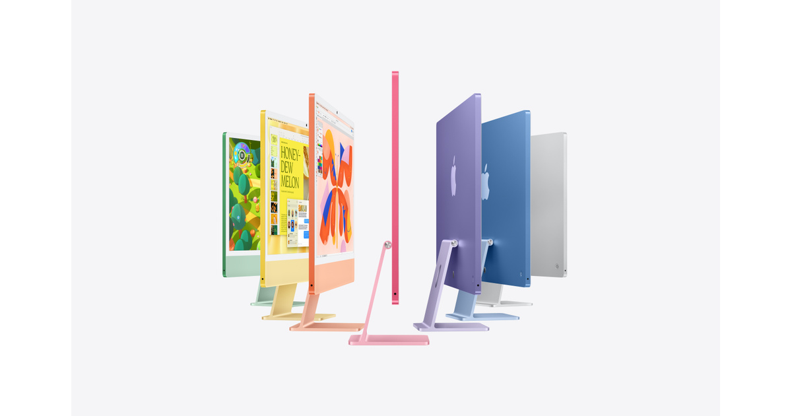

# iMac

## 基本信息

| 项目 | 内容 |
|---|---|
| 产品名 | iMac |
| 品牌 | Apple |
| 分类 | 电脑 |
| 系列 | Mac |
| 发布时间 | 2025 年，M5 款 |
| 同期发布颜色 | 蓝色、紫色、粉色、橙色、黄色、绿色、银色 |

## 产品介绍

iMac 是一体式桌面电脑，适合家庭、前台、办公、教育和轻创作空间。

## 同期发布颜色

| 颜色 | 说明 |
|---|---|
| 蓝色 | 官方发布配色 |
| 紫色 | 官方发布配色 |
| 粉色 | 官方发布配色 |
| 橙色 | 官方发布配色 |
| 黄色 | 官方发布配色 |
| 绿色 | 官方发布配色 |
| 银色 | 官方发布配色 |

## 核心卖点

- Apple 生态深度协同，适合与 iPhone、iPad、Mac、Apple Watch 等设备联动。
- 官方渠道价格透明，支持分期、送货、到店取货和 Apple Trade In 换购。
- 适合看重长期系统更新、硬件做工和售后服务的用户。

## 参数

| 项目 | 内容 |
|---|---|
| 芯片 | Apple M5 |
| 屏幕 | 24 英寸 4.5K Retina 显示屏 |
| 内存 | 16GB 起 |
| 存储 | 256GB SSD 起 |
| 摄像头 | 内置高清摄像头 |

## 可选配置及中国价格

> 价格口径：中国大陆 Apple 官方在线商店起售价或常见基础配置价格，单位为人民币。实际成交价可能因渠道、促销、教育优惠、以旧换新、分期和库存变化。

| 配置 | 可选颜色 | 中国价格 |
|---|---|---:|
| M5 / 16GB / 256GB / 8 核图形处理器 | 部分颜色 | RMB 10,999 起 |
| M5 / 16GB / 256GB / 10 核图形处理器 | 全部发布颜色 | RMB 12,499 起 |
| M5 / 16GB / 512GB / 10 核图形处理器 | 全部发布颜色 | RMB 14,499 起 |

## 电商式购买建议

家庭和办公选入门款。想要更多接口和颜色选 10 核图形处理器版本。

## 适合人群

- 已在 Apple 生态内，想要更好设备协同的用户。
- 重视官方售后、系统更新和产品生命周期的用户。
- 想按预算和配置清晰选购的用户。

## 数据来源

- Apple 中国大陆官网产品页和在线商店页面。
- Apple 中国大陆官网技术规格页面。
- 中国大陆公开发售信息和 Apple 官方新闻稿。
