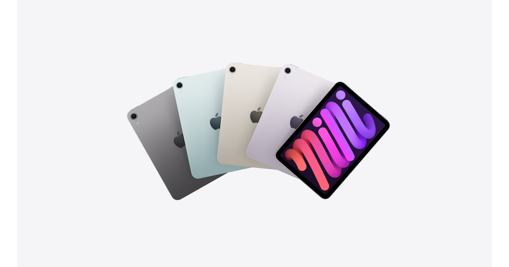

# iPad mini

## 基本信息

| 项目 | 内容 |
|---|---|
| 产品名 | iPad mini |
| 品牌 | Apple |
| 分类 | 平板 |
| 系列 | iPad |
| 发布时间 | 2024 年，A17 Pro 款 |
| 同期发布颜色 | 蓝色、紫色、星光色、深空灰色 |

## 产品介绍

iPad mini 是小尺寸平板，适合阅读、随身笔记、游戏和移动查看资料。

## 同期发布颜色

| 颜色 | 说明 |
|---|---|
| 蓝色 | 官方发布配色 |
| 紫色 | 官方发布配色 |
| 星光色 | 官方发布配色 |
| 深空灰色 | 官方发布配色 |

## 核心卖点

- Apple 生态深度协同，适合与 iPhone、iPad、Mac、Apple Watch 等设备联动。
- 官方渠道价格透明，支持分期、送货、到店取货和 Apple Trade In 换购。
- 适合看重长期系统更新、硬件做工和售后服务的用户。

## 参数

| 项目 | 内容 |
|---|---|
| 芯片 | A17 Pro |
| 屏幕 | 8.3 英寸 Liquid Retina 显示屏 |
| 容量 | 128GB、256GB、512GB |
| 连接 | Wi-Fi 或 Wi-Fi + 蜂窝网络 |

## 可选配置及中国价格

> 价格口径：中国大陆 Apple 官方在线商店起售价或常见基础配置价格，单位为人民币。实际成交价可能因渠道、促销、教育优惠、以旧换新、分期和库存变化。

| 配置 | 可选颜色 | 中国价格 |
|---|---|---:|
| Wi-Fi / 128GB | 全部发布颜色 | RMB 3,999 起 |
| Wi-Fi / 256GB | 全部发布颜色 | RMB 4,799 起 |
| Wi-Fi / 512GB | 全部发布颜色 | RMB 6,399 起 |

## 电商式购买建议

便携优先选 iPad mini。需要键盘生产力选 iPad Air 或 iPad Pro。

## 适合人群

- 已在 Apple 生态内，想要更好设备协同的用户。
- 重视官方售后、系统更新和产品生命周期的用户。
- 想按预算和配置清晰选购的用户。

## 数据来源

- Apple 中国大陆官网产品页和在线商店页面。
- Apple 中国大陆官网技术规格页面。
- 中国大陆公开发售信息和 Apple 官方新闻稿。
