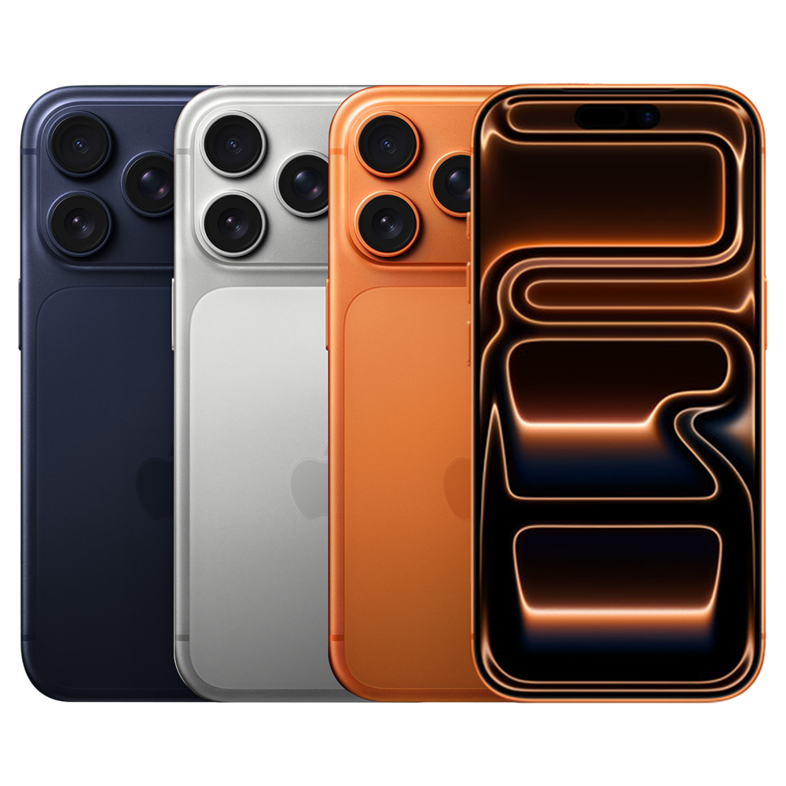

# iPhone 17 Pro Max

## 基本信息

| 项目 | 内容 |
|---|---|
| 产品名 | iPhone 17 Pro Max |
| 品牌 | Apple |
| 分类 | 手机 |
| 系列 | iPhone Pro |
| 发布时间 | 2025 年 9 月 |
| 同期发布颜色 | 银色、星宇橙色、深蓝色 |

## 产品介绍

iPhone 17 Pro Max 是大屏 Pro 旗舰，适合重度影音、游戏、影像创作和长续航需求。

## 同期发布颜色

| 颜色 | 说明 |
|---|---|
| 银色 | 官方发布配色 |
| 星宇橙色 | 官方发布配色 |
| 深蓝色 | 官方发布配色 |

## 核心卖点

- Apple 生态深度协同，适合与 iPhone、iPad、Mac、Apple Watch 等设备联动。
- 官方渠道价格透明，支持分期、送货、到店取货和 Apple Trade In 换购。
- 适合看重长期系统更新、硬件做工和售后服务的用户。

## 参数

| 项目 | 内容 |
|---|---|
| 芯片 | A19 Pro |
| 显示屏 | Super Retina XDR 显示屏 |
| 屏幕尺寸 | 6.9 英寸 |
| 刷新率 | ProMotion 自适应刷新率，最高 120Hz |
| 容量 | 256GB、512GB、1TB、2TB |
| 接口 | USB-C |
| 生物识别 | Face ID |

## 可选配置及中国价格

> 价格口径：中国大陆 Apple 官方在线商店起售价或常见基础配置价格，单位为人民币。实际成交价可能因渠道、促销、教育优惠、以旧换新、分期和库存变化。

| 配置 | 可选颜色 | 中国价格 |
|---|---|---:|
| 256GB | 银色、星宇橙色、深蓝色 | RMB 9,999 |
| 512GB | 银色、星宇橙色、深蓝色 | RMB 11,999 |
| 1TB | 银色、星宇橙色、深蓝色 | RMB 13,999 |
| 2TB | 银色、星宇橙色、深蓝色 | RMB 17,999 |

## 电商式购买建议

想要最大屏幕和最长续航选 Pro Max。2TB 只建议重度视频创作者购买。

## 适合人群

- 已在 Apple 生态内，想要更好设备协同的用户。
- 重视官方售后、系统更新和产品生命周期的用户。
- 想按预算和配置清晰选购的用户。

## 数据来源

- Apple 中国大陆官网产品页和在线商店页面。
- Apple 中国大陆官网技术规格页面。
- 中国大陆公开发售信息和 Apple 官方新闻稿。
