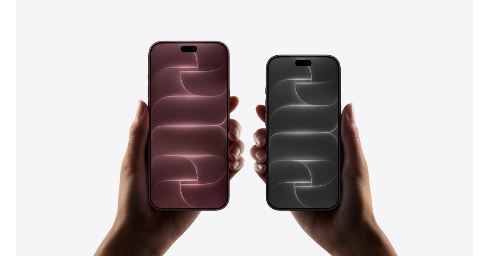

# iPhone 18 Pro

## 基本信息

| 项目 | 内容 |
|---|---|
| 产品名 | iPhone 18 Pro |
| 品牌 | Apple |
| 分类 | 手机 |
| 系列 | iPhone Pro |
| 发布时间 | 2026 年 9 月 9 日发布，9 月 12 日预购，9 月 18 日发售 |
| 同期发布颜色 | 黑色、银色、冰川蓝色、勃艮第酒红色 |

## 产品介绍

iPhone 18 Pro 是 Apple 2026 年 Pro 旗舰手机，主打 A20 Pro 芯片、专业影像、可变光圈主摄、增强散热和 Apple Intelligence。

## 同期发布颜色

| 颜色 | 说明 |
|---|---|
| 黑色 | 官方发布配色 |
| 银色 | 官方发布配色 |
| 冰川蓝色 | 官方发布配色 |
| 勃艮第酒红色 | 官方发布配色 |

## 核心卖点

- 新一代 Apple 芯片，面向高性能、影像和 Apple Intelligence 场景。
- 中国大陆官方渠道支持分期、送货、到店取货和 Apple Trade In 换购。
- 适合看重长期系统更新、硬件做工和 Apple 生态协同的用户。

## 参数

| 项目 | 内容 |
|---|---|
| 芯片 | A20 Pro |
| 屏幕 | 6.3 英寸 Super Retina XDR 显示屏 |
| 刷新率 | ProMotion 自适应刷新率，最高 120Hz |
| 摄像头 | Pro 级融合式摄像头系统，可变光圈主摄 |
| 容量 | 256GB、512GB、1TB、2TB |
| 接口 | USB-C |
| 系统 | iOS 27 |

## 可选配置及中国价格

> 价格口径：中国大陆官方发售信息，单位为人民币。实际成交价可能因渠道、促销、以旧换新、分期和库存变化。

| 配置 | 可选颜色 | 中国价格 |
|---|---|---:|
| 256GB | 黑色、银色、冰川蓝色、勃艮第酒红色 | RMB 9,999 |
| 512GB | 黑色、银色、冰川蓝色、勃艮第酒红色 | RMB 11,999 |
| 1TB | 黑色、银色、冰川蓝色、勃艮第酒红色 | RMB 13,999 |
| 2TB | 黑色、银色、冰川蓝色、勃艮第酒红色 | RMB 15,999 |

## 电商式购买建议

多数 Pro 用户选 256GB 或 512GB。长期拍摄 ProRes、4K 视频或本地素材多，选 1TB/2TB。

## 适合人群

- 已在 Apple 生态内，想要最新 iPhone 体验的用户。
- 重视影像、性能、系统更新和售后服务的用户。
- 想按容量和预算清晰选购的用户。

## 数据来源

- Apple 中国大陆官网产品页、在线商店页面和新闻稿。
- Apple 官方技术规格页面。
- 中国大陆公开发售信息。
