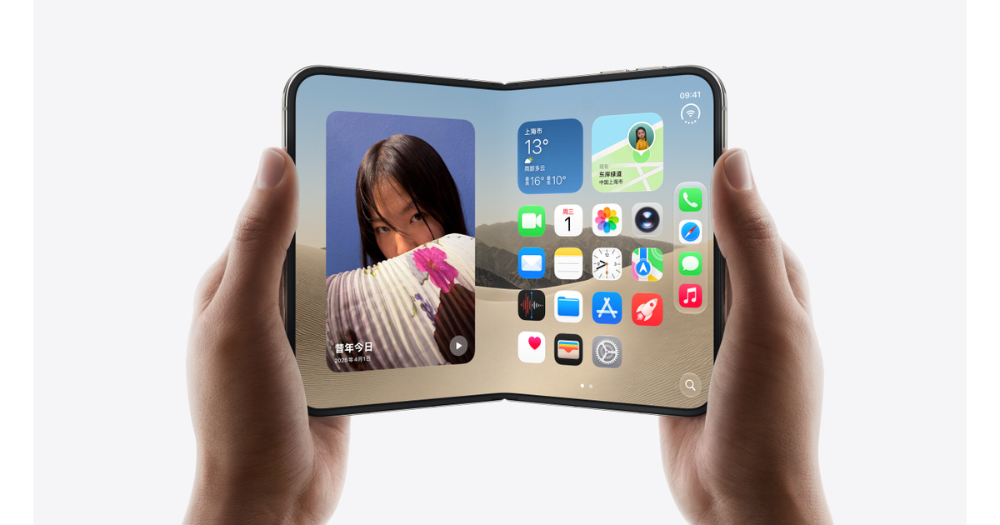

# iPhone Duo

## 基本信息

| 项目 | 内容 |
|---|---|
| 产品名 | iPhone Duo |
| 品牌 | Apple |
| 分类 | 手机 / 折叠屏手机 |
| 系列 | iPhone Duo |
| 发布时间 | 2026 年 9 月 9 日发布，10 月 16 日预购，10 月 23 日发售 |
| 同期发布颜色 | 星白色、夜空色 |

## 产品介绍

iPhone Duo 是 Apple 首款折叠屏 iPhone，适合想要手机和平板体验合一、重视大屏多任务和新形态体验的用户。

## 同期发布颜色

| 颜色 | 说明 |
|---|---|
| 星白色 | 官方发布配色 |
| 夜空色 | 官方发布配色 |

## 核心卖点

- 新一代 Apple 芯片，面向高性能、影像和 Apple Intelligence 场景。
- 中国大陆官方渠道支持分期、送货、到店取货和 Apple Trade In 换购。
- 适合看重长期系统更新、硬件做工和 Apple 生态协同的用户。

## 参数

| 项目 | 内容 |
|---|---|
| 芯片 | A20 Pro |
| 内屏 | 7.6 英寸折叠式 Super Retina XDR 显示屏 |
| 外屏 | 5.4 英寸外屏 |
| 摄像头 | 双 48MP 后置摄像头 |
| 容量 | 256GB、512GB、1TB、2TB |
| 连接 | eSIM |
| 系统 | iOS 27 |

## 可选配置及中国价格

> 价格口径：中国大陆官方发售信息，单位为人民币。实际成交价可能因渠道、促销、以旧换新、分期和库存变化。

| 配置 | 可选颜色 | 中国价格 |
|---|---|---:|
| 256GB | 星白色、夜空色 | RMB 15,999 |
| 512GB | 星白色、夜空色 | RMB 17,999 |
| 1TB | 星白色、夜空色 | RMB 21,499 |
| 2TB | 星白色、夜空色 | RMB 26,499 |

## 电商式购买建议

尝鲜折叠屏和大屏多任务选 iPhone Duo。价格高，建议先线下体验铰链、重量和应用适配。

## 适合人群

- 已在 Apple 生态内，想要最新 iPhone 体验的用户。
- 重视影像、性能、系统更新和售后服务的用户。
- 想按容量和预算清晰选购的用户。

## 数据来源

- Apple 中国大陆官网产品页、在线商店页面和新闻稿。
- Apple 官方技术规格页面。
- 中国大陆公开发售信息。
