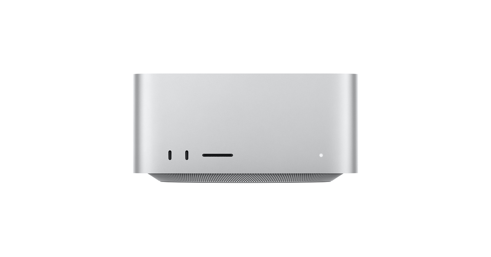

# Mac Studio

## 基本信息

| 项目 | 内容 |
|---|---|
| 产品名 | Mac Studio |
| 品牌 | Apple |
| 分类 | 电脑 |
| 系列 | Mac |
| 发布时间 | 2025 年，M4 Max / M3 Ultra 款 |
| 同期发布颜色 | 银色 |

## 产品介绍

Mac Studio 是高性能桌面工作站，适合影视后期、3D、机器学习、音乐制作和大型工程。

## 同期发布颜色

| 颜色 | 说明 |
|---|---|
| 银色 | 官方发布配色 |

## 核心卖点

- Apple 生态深度协同，适合与 iPhone、iPad、Mac、Apple Watch 等设备联动。
- 官方渠道价格透明，支持分期、送货、到店取货和 Apple Trade In 换购。
- 适合看重长期系统更新、硬件做工和售后服务的用户。

## 参数

| 项目 | 内容 |
|---|---|
| 芯片 | M4 Max 或 M3 Ultra |
| 内存 | 36GB 起 |
| 存储 | 512GB SSD 起 |
| 接口 | Thunderbolt、HDMI、10Gb 以太网、SDXC |

## 可选配置及中国价格

> 价格口径：中国大陆 Apple 官方在线商店起售价或常见基础配置价格，单位为人民币。实际成交价可能因渠道、促销、教育优惠、以旧换新、分期和库存变化。

| 配置 | 可选颜色 | 中国价格 |
|---|---|---:|
| M4 Max / 36GB / 512GB | 银色 | RMB 16,499 起 |
| M3 Ultra / 96GB / 1TB | 银色 | RMB 32,999 起 |

## 电商式购买建议

创意专业工作选 M4 Max。极重度本地计算和多路素材选 M3 Ultra。

## 适合人群

- 已在 Apple 生态内，想要更好设备协同的用户。
- 重视官方售后、系统更新和产品生命周期的用户。
- 想按预算和配置清晰选购的用户。

## 数据来源

- Apple 中国大陆官网产品页和在线商店页面。
- Apple 中国大陆官网技术规格页面。
- 中国大陆公开发售信息和 Apple 官方新闻稿。
