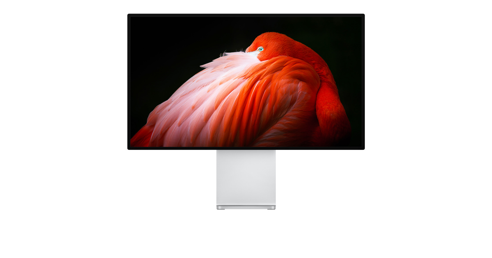

# Pro Display XDR

## 基本信息

| 项目 | 内容 |
|---|---|
| 产品名 | Pro Display XDR |
| 品牌 | Apple |
| 分类 | 显示器 |
| 系列 | Display |
| 发布时间 | 2019 年 |
| 同期发布颜色 | 银色 |

## 产品介绍

Pro Display XDR 是专业参考级显示器，适合影视调色、HDR 制作、摄影和高端设计工作流。

## 同期发布颜色

| 颜色 | 说明 |
|---|---|
| 银色 | 官方发布配色 |

## 核心卖点

- Apple 生态深度协同，适合与 iPhone、iPad、Mac、Apple Watch 等设备联动。
- 官方渠道价格透明，支持分期、送货、到店取货和 Apple Trade In 换购。
- 适合看重长期系统更新、硬件做工和售后服务的用户。

## 参数

| 项目 | 内容 |
|---|---|
| 尺寸 | 32 英寸 |
| 分辨率 | 6K Retina |
| 亮度 | XDR 峰值亮度 |
| 玻璃 | 标准玻璃或纳米纹理玻璃 |

## 可选配置及中国价格

> 价格口径：中国大陆 Apple 官方在线商店起售价或常见基础配置价格，单位为人民币。实际成交价可能因渠道、促销、教育优惠、以旧换新、分期和库存变化。

| 配置 | 可选颜色 | 中国价格 |
|---|---|---:|
| 标准玻璃 | 银色 | RMB 39,999 起 |
| 纳米纹理玻璃 | 银色 | RMB 47,999 起 |
| Pro Stand | 银色 | RMB 7,799 |
| VESA Mount Adapter | 银色 | RMB 1,599 |

## 电商式购买建议

专业 HDR 和参考监看需求选 Pro Display XDR。普通 Mac 办公选 Studio Display。

## 适合人群

- 已在 Apple 生态内，想要更好设备协同的用户。
- 重视官方售后、系统更新和产品生命周期的用户。
- 想按预算和配置清晰选购的用户。

## 数据来源

- Apple 中国大陆官网产品页和在线商店页面。
- Apple 中国大陆官网技术规格页面。
- 中国大陆公开发售信息和 Apple 官方新闻稿。
