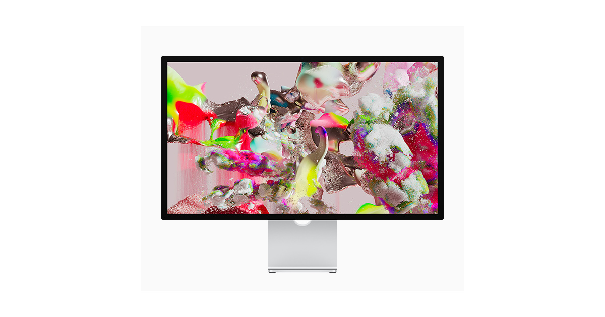

# Studio Display

## 基本信息

| 项目 | 内容 |
|---|---|
| 产品名 | Studio Display |
| 品牌 | Apple |
| 分类 | 显示器 |
| 系列 | Display |
| 发布时间 | 2022 年 |
| 同期发布颜色 | 银色 |

## 产品介绍

Studio Display 是 27 英寸 5K 显示器，适合 Mac 桌面办公、设计和内容创作。

## 同期发布颜色

| 颜色 | 说明 |
|---|---|
| 银色 | 官方发布配色 |

## 核心卖点

- Apple 生态深度协同，适合与 iPhone、iPad、Mac、Apple Watch 等设备联动。
- 官方渠道价格透明，支持分期、送货、到店取货和 Apple Trade In 换购。
- 适合看重长期系统更新、硬件做工和售后服务的用户。

## 参数

| 项目 | 内容 |
|---|---|
| 尺寸 | 27 英寸 |
| 分辨率 | 5K Retina |
| 亮度 | 600 尼特 |
| 摄像头 | 内置超广角摄像头 |
| 音频 | 六扬声器系统 |

## 可选配置及中国价格

> 价格口径：中国大陆 Apple 官方在线商店起售价或常见基础配置价格，单位为人民币。实际成交价可能因渠道、促销、教育优惠、以旧换新、分期和库存变化。

| 配置 | 可选颜色 | 中国价格 |
|---|---|---:|
| 标准玻璃 / 倾斜可调支架 | 银色 | RMB 11,499 起 |
| 纳米纹理玻璃 / 倾斜可调支架 | 银色 | RMB 13,499 起 |
| 高度可调支架版本 | 银色 | 加价选配 |

## 电商式购买建议

Mac 桌面用户想要高分辨率、摄像头和扬声器一体化，选 Studio Display。

## 适合人群

- 已在 Apple 生态内，想要更好设备协同的用户。
- 重视官方售后、系统更新和产品生命周期的用户。
- 想按预算和配置清晰选购的用户。

## 数据来源

- Apple 中国大陆官网产品页和在线商店页面。
- Apple 中国大陆官网技术规格页面。
- 中国大陆公开发售信息和 Apple 官方新闻稿。
